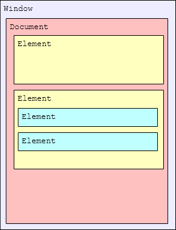
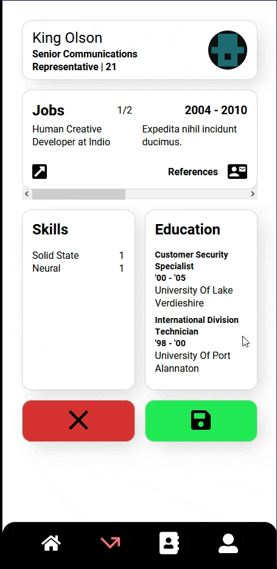
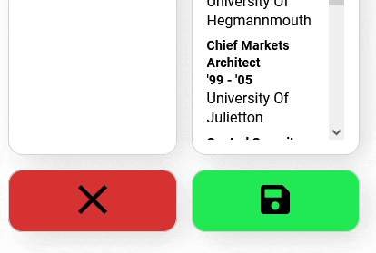
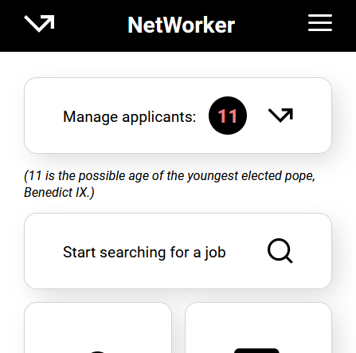

# API's

# Web API

For this project we were tasked with using (at least) 3 web API's. In the end I used 5, some of which are really basic.

## HTML Dom API

If you have ever made a website of any kind, you will have used this API.

The Dom defines the structure of all the elements in an html file, and their respective depth.

The Dom also includes the head portion of the document, as well as the metadata of the document.



You can manipulate the Dom in javascript using things like .innerText and .remove().
That is what I did in my implementation.

```js
axios
  .post(`/api/delete-applicant/${userId}`)
  .then((response) => {
    document.querySelector(`.cv:nth-of-type(${userIndex + 1})`).remove();
  })
  .catch((error) => {
    console.log(error);
  });

axios.post(`/api/generate-applicants/5`).then((response) => {
  const currentNumber = matchesNumber.textContent;
  const newNumber = parseInt(currentNumber) + response.data.data.length;
  matchesNumber.textContent = newNumber;
});
```

## Notification API

The notification API is very straightforward. It allows the application to send a system notification to the user (granted the user allows those).

First you need to request permission to send notifications. This is usually done with the input of the user, as it can be very annoying when the user gets all kinds of permission request on page load.

Then you can simple send a notification with the code below. You can optionally send data with it, like a body, tag, icon, etc...

```js
generateBtn?.addEventListener("click", async (e) => {
  e.preventDefault();
  await Notification.requestPermission();
  new Notification("Added 5 new applicants");
```

## Intersection observer API

Intersection observer API was quite daunting at first, because it has a lot of setup to get it working. When I got the hang of this API it really started improving my websites, and I have not stopped using it since.

That is why I used the intersection observer API in this project.

To get it working, you need to create an intersectionObserver for a specific element on the page. If that page receives an intersection, a callback will be exececuted.

This only happens when an element is being observed though, which is why you need to .observe the element that you want to intersect.

Once this is working you can just do whatever you need to in the callback (in my case this was removing a class), and you can choose to unobserve the element you had an intersection with.

This is how I implemented it:

As soon as the cv enters the screen (intersects with it) it removes the hidden class which restores opacity and scale.



```js
const hiddenCvs = document.querySelectorAll(".cv:not(:first-of-type)");

const onVisible = (entries, observer) => {
  console.log("yay", entries);
  entries.forEach((entry) => {
    if (entry.isIntersecting) {
      console.log(entry.target);
      entry.target.classList.remove("hidden");
      observer.unobserve(entry.target);
    }
  });
};

let options = {
  root: document.querySelector("body"),
  rootMargin: "0px",
  threshold: 0.3,
};
let observer = new IntersectionObserver(onVisible, options);

hiddenCvs.forEach((cv) => {
  cv.classList.add("hidden");
  observer.observe(cv);
});
```

## Fetch API

The fetch API is a general way of fetching data from an external API, using a fetch command with a url as well as a response.

You can define a method like 'post' or 'get' along with other parameters.

In my code I used the package called axios to streamline the fetching and posting of data. It uses the fetch API but makes it a bit more readable.

```js
axios.post(`/api/generate-applicants/5`).then((response) => {
  const currentNumber = matchesNumber.textContent;
  const newNumber = parseInt(currentNumber) + response.data.data.length;
  matchesNumber.textContent = newNumber;
});
```

## Web animation API

Web animations are also fairly straightforward.

You first need to make keyframes with the @keyframes tag, and afterwards you can just assign the keyframes to an element, which will play when the css gets applied (or when you .animate() in the js).

I made the following animation:



```scss
&.btn-save {
  background: rgb(33, 233, 83);
  &:hover img {
    animation: rotation 1s forwards;
  }

  @keyframes rotation {
    0% {
      transform: scale(1) rotate(0deg);
    }
    50% {
      transform: scale(1.4) rotate(180deg);
    }
    100% {
      transform: scale(1) rotate(360deg);
    }
  }
}
```

# Third Party API

## Faker

I will use the Fakerjs third party api to populate my database with fake people.
I am going to use this api because I have used it at work in the past, and I don't want to fill my own database by hand.

I want to add a button that adds more potential applicants to simulate real-life conditions.
With this API you can basically call a function that randomly generates a piece of data for you, and they have a library of different types.

You need to call the API for each individual field, and I don't think node bundles those calls together. In that case I did make multiple calls. This doesn't happen on the client though. It all happens on the server.
This API doesn't require any authentication.

Below is my code, where I use faker in my backend to generate such data.

```js
const createFakeApplicants = (amount) => {
  const applicants = [];
  for (let i = 0; i < amount; i++) {
    const applicant = {
      firstName: faker.person.firstName(),
      lastName: faker.person.lastName(),
      email: faker.internet.email(),
      age: faker.number.int({ min: 18, max: 99 }),
      job: faker.person.jobTitle(),
      image: faker.image.avatar(),
      jobs: createFakeJobs(faker.number.int({ min: 2, max: 5 })),
      education: createFakeEducation(faker.number.int({ min: 2, max: 5 })),
      skills: createFakeSkills(faker.number.int({ min: 2, max: 5 })),
    };
    applicants.push(applicant);
  }
  return applicants;
};

------(One of the array generators)------

const createFakeSkills = (amount) => {
  const skills = [];

  for (let i = 0; i < amount; i++) {
    const skill = {
      title: faker.hacker.adjective(),
      level: faker.number.int({ min: 1, max: 10 }),
    };
    skills.push(skill);
  }
  return skills;
};
```

## Numbersapi

Since the first one is more of an npm package than a traditional API, I also added a funny facts API that displays a fact for the amount of applicants you have (doesn't make a whole lot of sense in a professional application, but it's something).

It updates when you generate more applicants.



```js
const generateFact = async (number) => {
  const res = await axios
    .get(`http://numbersapi.com/${number}`)
    .then((response) => {
      funnyFact.textContent = `(${response.data})`;
      funnyFact.classList.remove("empty");
    })
    .catch((error) => {
      console.log(error);
    });
};

if (funnyFact) {
  generateFact(matchesNumber.textContent);
}
```
