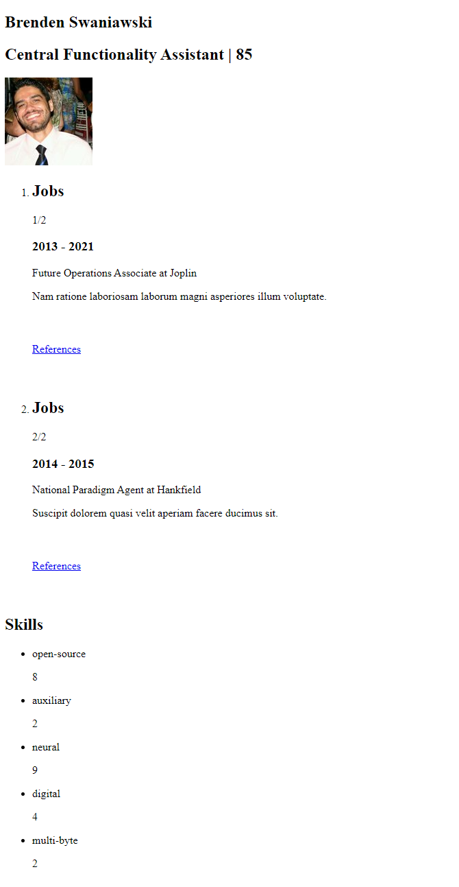
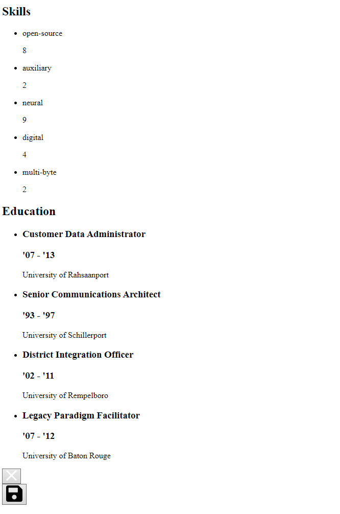

# Client-side Component

# My client-side javascript

I use a decent amount of client-side js.

- API call to generate a fact based on a number
- API call to generate applications
- Functionality for a burger/side menu
- API call to remove saved applications from the user model
- API call to save applications to the user model
- API call to update the viewed applications
- IntersectionObserver to animate in an application when it comes on screen
- Notification to notify the user they successfully generated 5 new applications
- Added various classes to enable js animations

To get a better picture of the code please just go to the [code itself](https://github.com/kryxeno/blok-tech/tree/main/public), or look at the [api wiki](https://github.com/kryxeno/blok-tech/wiki/api).

# ES6 features

As far as es6 features go I am pretty sure I used all the prevalent features.

- Const and let
- Arrow functions
- Anonymous functions
- Async / await
- Template literals
- Etc...

# CSS enhancements

Well first of all the general design is enhanced with css. Using grid I made the buttons on the homepage and the sections on the match & contacts page.

I added hover states for the buttons and I added transitions and animations for various elements on the match page.


These are also partially initialized with js.

I also added scroll snap so that the page snaps to an application.

# JS fallback

In order to properly execute progressive enhancement, I made sure the page still completely functions without the use of javascript.

- If the API call for the fact doesn't work the fact element is just hidden away from the other elements with css.
- If the API calls for the application management don't work, there is a fallback form and API route to work without client js. After submitting the form the page reloads with the new data to properly update the array of objects on the page.
- If the animations don't work for the swipe up, the user can just scroll through the entire list instead (which is not necessary as the page reloads on every button click).

```js
cvList.classList.add("animated-scroll");
```

- If the burger menu doesn't work, the user will always have the buttons on the button of the screen that work without js (they are the same buttons).
- If the user clicks on generate applicants, the page will also reload to reflect the updated applications.
- In the frontend js the hidden class is added to every application, so if the js doesn't work they won't be hidden in the first place, and they will still be visible for the user.

```js
hiddenCvs.forEach((cv) => {
  cv.classList.add("hidden");
  observer.observe(cv);
});
```

# CSS fallback

There could be the case of a total failure of the css, in which case the application would still function properly. It won't look amazing, but it's fine and everything looks clean.




# Browser support

I made sure to only use features that are supported by all the modern browsers. If there are 'experimental' features used, they will only be for specific enhancements, like scroll-snap for example. The user experience won't be majorly hindered.

I checked all the modern browsers, and the application still functions.
There are some minor errors with certain extensions (like password managers) but these don't directly impact the website.
