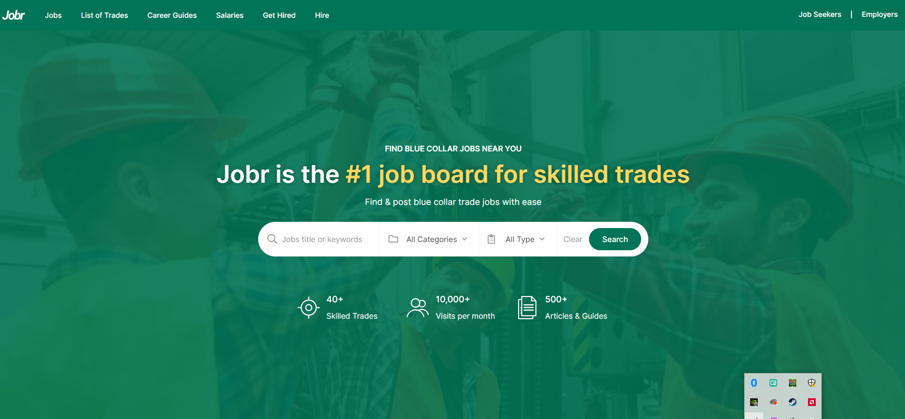
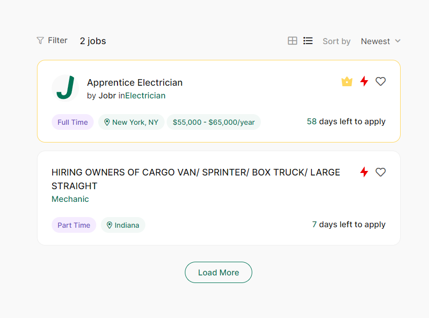

# Concept

In order to find an idea I started with a mindmap.

I separated the types of ideas into three groups. Objects, invididuals and groupes.
It can be useful to separate these categories in the concept phase, because a 'matching' app generally just trades information or products, and any of the apps in a certain category are almost always interchangable.

Eventually I chose to continue with 'vacatures', because a matching app for professionals feels relatively untapped market as far as I know.

# Good and bad practices

I have selected two companies that show jobs for the individual.

## Jobr

Jobr is a platform where people looking for a job can filter through various jobs and apply.
I picked this company because it has a similar goal as my own, namely to connect individuals and companies through an easy to use application.

Good practices:

- The entries have important information like labels on the card.
- They have the option to sort in categories.
- All of this data is preloaded, which really helps SEO.

Bad practices:

- The call to action is hidden lower in the detail page, instead of high on the page.
- There isnt an indication of the amount of jobs a person is expected to find before searching
- The jobs you can filter on are very vague and/or general

## Indeed

Indeed is the largest job application website on the internet. Similarly to Jobr they allow a user to filter jobs and apply. This however is also a very filter and search based application.

Good practices:

- Indeed has the CTA right at the top of the application
- In the card they show the most important information first

Bad practices:

- You cant always send in an application.
- There is no obvious way to save applications for later viewing
- Indeed allows the company to make their own message, and there can be a lot of inconsistencies between messages. A template with headings would be better for the end user.

# What does this mean for my design

What is evident from the existing solutions is that the important information should be served first, with an option to look more in depth into the various details of the card.

The application should be its own record, with relevant information inside.

It should also be clear and easy to find the CTA
