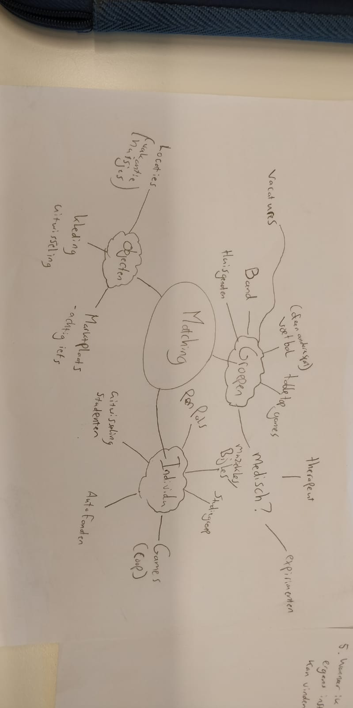
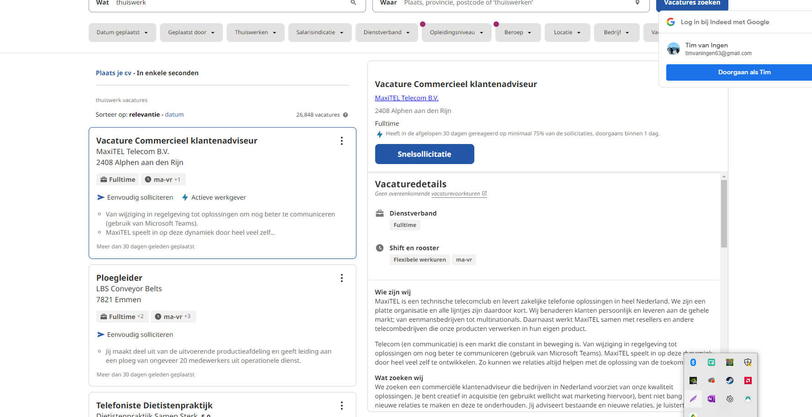

# Concept

In order to find an idea I started with a mindmap.

I separated the types of ideas into three groups. Objects, invididuals and groupes.
I did this because the types of applications are dependent on what is being matched.

Eventually I chose to continue with 'vacatures', because a matching app for professionals feels relatively untapped market as far as I know.

# Good and bad practices

I have selected two companies that show jobs for the individual.

Jobr is a platform where people looking for a job can filter through various jobs and apply.

Good practices:

- The entries have important information like labels on the card.
- They have the option to sort in categories.

Bad practices:

- The call to action is hidden lower in the detail page, instead of high on the page.

Indeed is the largest job application website on the internet. Similarly to Jobr they allow a user to filter jobs and apply.

Good practices:

- Indeed has the CTA right at the top of the application
- In the card they show the most important information first

Bad practices:

Indeed allows the company to make their own message, and there can be a lot of inconsistencies between messages. A template with headings would be better for the end user.

# What does this mean for my design

What is evident from the existing solutions is that the important information should be served first, with an option to look more in depth into the various details of the card.

It should also be clear and easy to find the CTA
