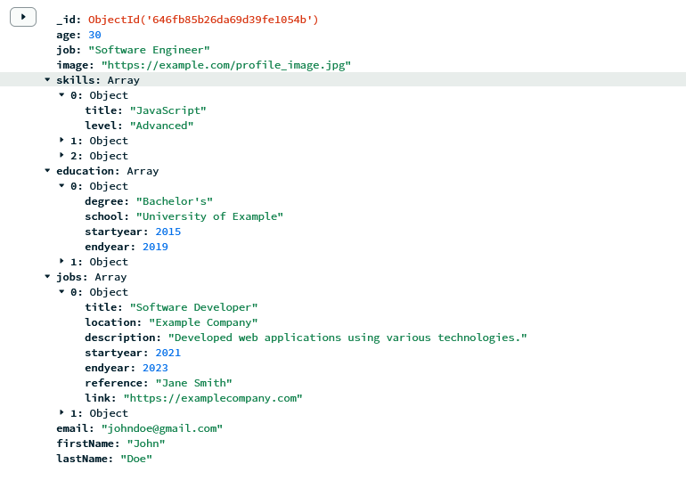

# Database Structure

My application objects have a large amount of data, including integers, objects, array's, strings, etc...

I just looked at what I needed for my feature, and added the fields one by one until I wasn't missing data anymore.

For the user I could have added a bunch more data that would be used in the application as a whole, like username, password, email, etc... but I decided to keep it simple in this instance as that will not be used anywhere in my application.

I have an applications collection and a user collection. The applications collection is for all the people the user will see. The user collection keeps track of what applications it has seen, and updates everything accordingly.

Right now the relation between the two is a one to many relation.

I thought about making a schema and models with things like prisma or mongoose, but I feel like that would be really overkill for an application of this size (even though I would absolutely make one in a real application). The safety you have with for example prisma just prevents so many unnecessary bugs.
