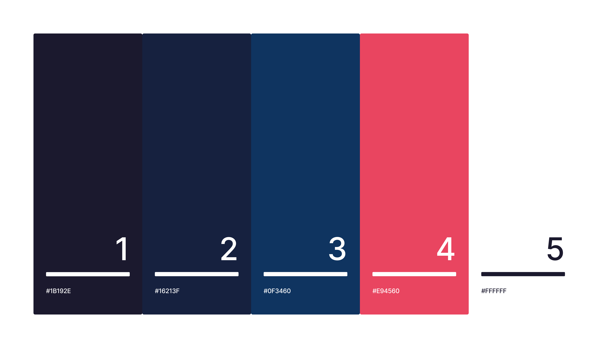
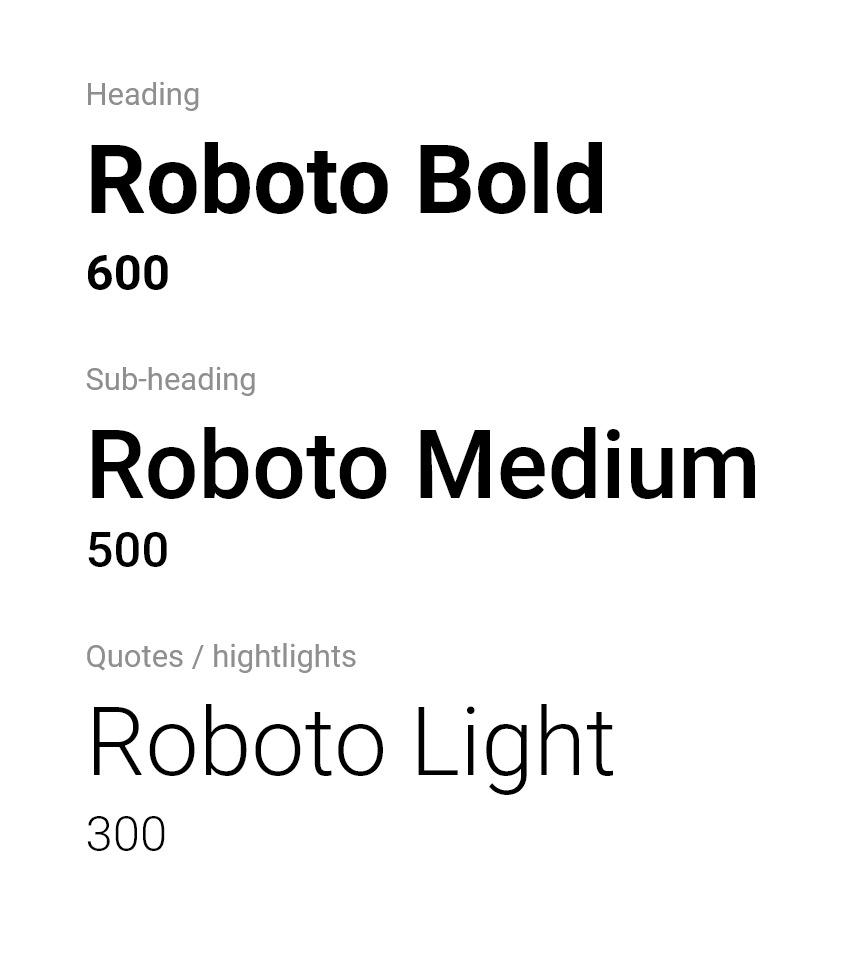
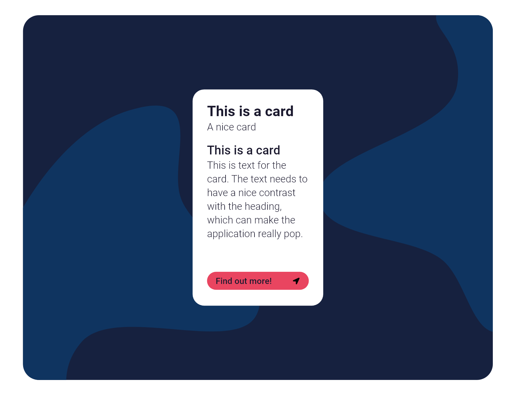

# Design

The design is an extremely important part of every application, and this application is no different. On this page I will attempt to define the style of my application through colors, typography and shape, while utilizing a moodboard.

## Improvements

In my first attempt (my current app), I didn't really have a good idea of what the design of the app was going to be. I had a few loose guidelines like 'professional' and 'clean' but nothing after that.

Everything you will see after this will be what I would have improved about the design of the app. You can still see the original design in the interface tab.

## Moodboard

When creating the moodboard, I tried to find inspiration through images that resonated with the goal of my application. These pictures are a collection of spaces, artwork, app designs, colors and textures. I wanted to have a healthy mix of conrete and abstract images, which could provide a lot of inspiration when creating the design.

## Colors

Colors heavily impact the user's experience with the app. Blue shifted colors (like blue, purple, cyan) generally convey trust to the user. When talking about an application that deals with a very serious subject matter, like a person's livelyhood, it is better to make sure the user feels safe using the app and confident that it will be functional/work properly.

That is why I decided to use the following color palette.

The darker colors (1, 2, 3) are for background and button. The darkest blue (1) is for text. The red color (4) will be for CTA buttons and other important parts of a page. Finally, the white color (5) will be the background for the main content of the page, like text.

## Typography

When looking at various job related or finance related applications I found that most use a sans-serif font of sorts, and generally the font is straight without being very playful.

I settled on roboto for my application. It is a very clean font and looks corporate.

## Shape

For the shape of the application I have decided to go with a grid-like card approach with rounded corners. More and more businesses are adding rounded corners to their applications, simply because that pattern is very hip right now. Due to that, I will adopt the same approach and add rounded corners to my grid elements (cards).

Another thing that seems to improve designs are shades of shapes in the background, like blobs. Just adding a couple of blobs to a background can really elevate the design.

I created an example of how this design would work.

