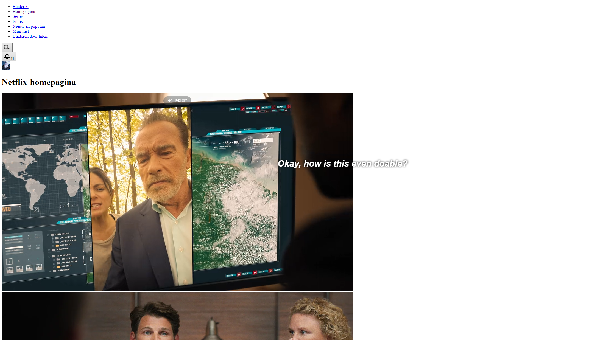

# Progressive Enhancement

Progressive enhancement is an approach in web development that uses JavaScript and CSS to make websites more interactive and visually appealing. It starts with a basic structure built using simple HTML, ensuring that the website works for all users. Then, additional features and styles are added to enhance the user experience for those with modern browsers and devices. It's about creating a strong foundation and gradually improving the website's look and functionality.

This is important, because this way every person can use the website regardless of device, internet speed, etc...

I checked out two websites (Netflix and Rijksoverheid).

# Netflix

When turning off the css on the netflix homepage, I can still navigate to all the pages. I did lose the option to hover over a card for more information or the preview, but technically I can still use the website.

The homepage was still mostly functional when turning off JS, but as soon as you clicked on a title the screen became grey and unresponsive. I think they are using frontend js to load the video, which obviously breaks.

# Rijksoverheid

When turning off the css on the rijksoverheid homepage, I can also still navigate to all the pages. It actually still looks fairly clean and I think it would be totally fine to use the website this way.
The JS was fully functional, as it is a pretty static site. It only displays articles and information.

# Implementation in my project

Since I am doing a matching feature, I think I will just display all the items under each other with all the relevant information still there.
Frontend javascript is still pretty integral to the function of my page, as people cant save applicants or update the posts they have seen, but they would still be able to see the information of the applicant and contact them in a different way.
