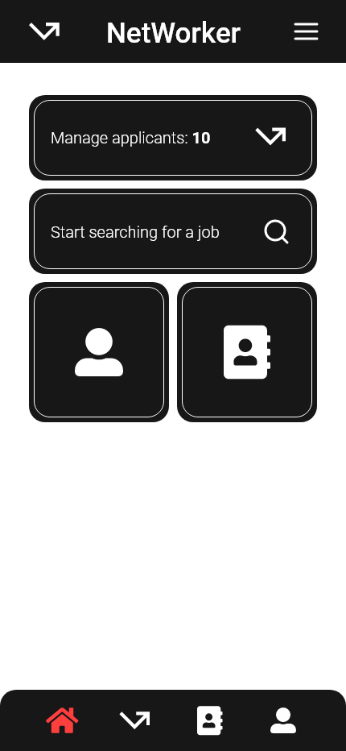
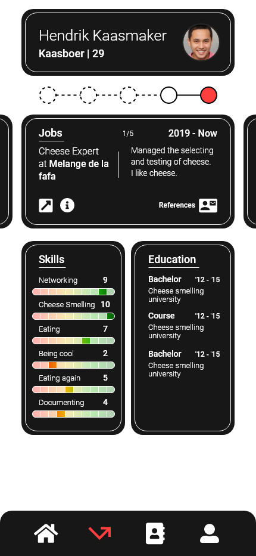

# Interface

I created a design for most of the screens I want to make. These designs are for the business side of the application.
An hr representative would use this application to sort through the incoming applications.

## Wireflow

Before making a high resolution design, I made a wireflow to see how my feature will work. As seen in the image below, The user starts on the homescreen. When pressing the match button, they get moved to the match page where applications will pop up. The user can click on save or ignore which will then move the current one out of frame and show a new one.

When the user has seen all the applications, they can go to their saved screen which will list all the saved applications (or any other time with the menu buttons).

## Design

I made a slightly higher res design that for example shows the application the user will see.

## Conclusion

I will attempt to recreate this design in the real application, while also keeping an eye on the requirements list.
