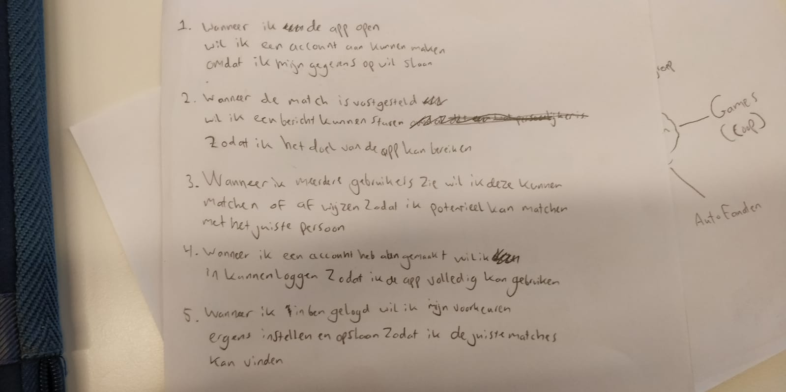

# Job Story

In order to better understand the features, I have created a few job stories that in one sentence describe what the feature is. The focus is on the functionality of the feature. I will then choose one of the job stories to develop the feature.

1. Wanneer ik een app open wil ik een account aan kunnen maken, omdat ik mijn gegevens op wil slaan. (Account)

2. Wanneer de match is vastgesteld wil ik een bericht kunnen sturen zodat ik het doel van de app kan bereiken. (Chat)

3. Wanneer ik meerdere gebruikers zie wil ik deze kunnen matchen of afwijzen zodat ik potentieel kan matchen met het juist persoon. (Match)

4. Wanneer ik een account heb aangemaakt wil ik in kunnen loggen zodat ik in de app voledig kan gebruiken. (Account)

5. Wanneer ik in ben gelogd wil ik mijn voorkeuren ergens instellen en opslaan zodat ik de juiste matches kan vinden. (Settings)

# My feature

I have chosen to make the third job story. Matching a company with an applicant. I chose to pursue this job story because making a functioning 'swipe' feature sounds like an interesting challenge, and it is the core of the application.
